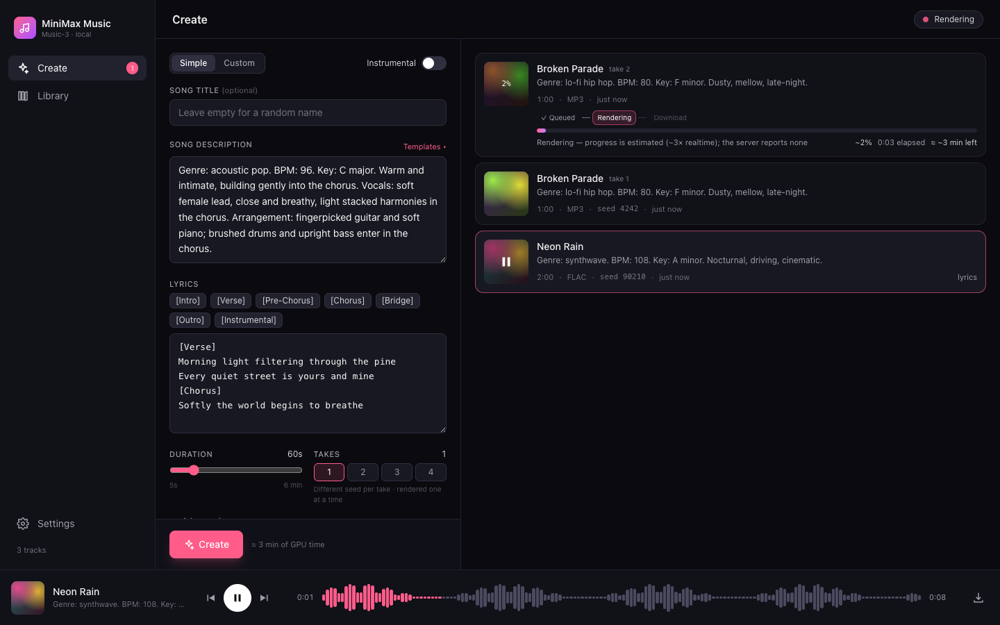

<p align="center">
  
</p>

<p align="center">
  A Suno-style web interface for any self-hosted <a href="https://huggingface.co/MiniMaxAI/MiniMax-Music3">MiniMax-Music3</a> server.<br>
  Write a style prompt and lyrics, queue takes, watch them render, and keep a local library with a waveform player.<br>
  Talks the standard <code>POST /v1/audio/speech</code> route, so it works with <code>sgl-omni serve</code> out of the box.
</p>

<p align="center">
  <a href="https://demo-minimax-music.adambh.dev"></a>
  <a href="https://github.com/adambenhassen/minimax-music-ui/actions/workflows/ci.yml"></a>
  <a href="https://github.com/adambenhassen/minimax-music-ui/pkgs/container/minimax-music-ui"></a>
  <a href="LICENSE"></a>
  
  
  
  
</p>

<p align="center">
  <b>Try it:</b> <a href="https://demo-minimax-music.adambh.dev">demo-minimax-music.adambh.dev</a> — a read-only demo with pre-rendered songs (Create simulates a render).
</p>

<p align="center">
  
</p>

## Features

- **Create panel** — Simple or Custom mode, song title (random name like “Velvet Horizon” if left empty), style description, lyrics editor with `[Verse]` / `[Chorus]` / … tag chips, instrumental toggle, duration 5–360 s, 1–4 takes per submit (each take gets `seed + i`), advanced seed. Output is WAV, as the official route documents (FLAC/MP3 appear in the selector but disabled).
- **Templates** — a built-in default plus your own saved templates (style, lyrics, duration), stored server-side.
- **Render queue** — the UI server renders one track at a time against the blocking `/v1/audio/speech` route and shows queued / rendering / done with elapsed time and an estimated bar (~3× realtime — the official API reports no progress). Cancel while queued or rendering, retry on error. Queued tracks survive a UI-server restart (they are re-queued in order); a render that was in flight is marked as interrupted.
- **Live progress + play while rendering** — when the server is the bundled `inference/server.py` (it advertises `capabilities: ["stream"]` on `/health`), progress is real for every render (Generating → Rendering, ETA from the measured rate). Tick *Play while rendering* under Advanced and the audio is streamed as it's rendered too: press play on a track that is still rendering, the waveform grows as windows arrive, the player buffers when it catches up with the renderer and swaps to the final file seamlessly. Stock `sgl-omni` keeps the estimated bar.
- **Library** — every finished render is saved into `data/tracks/` with its metadata (prompt, lyrics, seed, format). Cards show duration, seed and how long the render took. Search, download, delete, "reuse settings".
- **Track panel** — click a card to open a Suno-style side panel: big cover with play, status/progress, Download / Reuse / Retry / Delete, full style prompt and lyrics, and details (duration, seed, render time, created/finished). Esc closes it.
- **Player** — sticky bottom bar with waveform (decoded client-side), seek, prev/next, keyboard space to play/pause.
- **Health pill** — offline / loading model / idle (· live progress) / rendering · N queued (probes `GET /v1/models` and the optional `GET /health`).
- **Settings page** — point the app at your inference server (URL + optional API key) from the UI, with a "Test connection" button. Environment variables, when set, take precedence and lock those fields. A *Compatibility mode* debug switch makes the UI treat any server as stock `sgl-omni` (no `/health`, no streaming) to check the plain contract still works.
- Responsive down to phone width. No external services; everything runs on your machine or tailnet.

## Architecture

```
browser ──/api/*──▶ server/ (Express 5)  ──POST /v1/audio/speech──▶  MiniMax-Music3 server
                      │  one render at a time; audio response → disk       sgl-omni serve (:8000)  — blocking WAV
                      │  or SSE progress + PCM windows when advertised     inference/server.py (:7862) — + stream
                      └─▶ data/library.json · data/templates.json · data/settings.json · data/tracks/*.wav
```

| Package | What |
|---|---|
| `web/` | Vite + React 19 + TypeScript + Tailwind 4 single-page app. Talks only to `/api/*`. |
| `server/` | Express 5 + TypeScript. Owns the library, proxies generation, serves the built SPA. |
| `inference/` | Optional single-GPU MiniMax-Music3 server (Python, diffusers) exposing the same API as `sgl-omni serve`. |

## Requirements

- Node.js 20 or newer
- A running MiniMax-Music3 server exposing `POST /v1/audio/speech` — either:
  - MiniMax's own `sgl-omni serve --model-path MiniMaxAI/MiniMax-Music3 --port 8000` (two GPUs), or
  - the bundled single-GPU server in [`inference/`](inference/) (`python inference/server.py --port 7862`, ~24 GB VRAM) — same API, one card.

  See [Upstream API](#upstream-api).

## Quick start

```bash
git clone https://github.com/adambenhassen/minimax-music-ui.git
cd minimax-music-ui
npm install
npm run build
MUSIC_API=http://<inference-host>:8000 npm start
# → http://localhost:8787
```

Then open **Settings** in the sidebar and enter the inference server URL — or set `MUSIC_API` in the environment (see below).

### Docker

Prebuilt multi-arch images (amd64 + arm64) are published to GitHub Container Registry on every release:

```bash
docker run -d -p 8787:8787 -v "$PWD/data:/data" -e MUSIC_API=http://<inference-host>:8000 ghcr.io/adambenhassen/minimax-music-ui:latest
```

Or build locally:

```bash
docker compose up -d --build           # → http://localhost:8787, library persisted in ./data
# or
docker build -t minimax-music-ui .
docker run -d -p 8787:8787 -v "$PWD/data:/data" minimax-music-ui
```

Set `MUSIC_API` / `MUSIC_API_KEY` in the environment (or a `.env` next to `docker-compose.yml`) to pin the inference server; leave them unset to configure it from the Settings page. When the inference server runs on the Docker host, use `http://host.docker.internal:<port>/…`.

### Configuration

The inference server address is resolved in this order:

1. `MUSIC_API` / `MUSIC_API_KEY` environment variables — always win; the Settings page shows them locked
2. Values saved from the **Settings** page (`data/settings.json`, written with mode `0600`)
3. Default `http://127.0.0.1:7862`

| Variable | Default | Description |
|---|---|---|
| `MUSIC_API` | – | Base URL of the inference server, path prefix allowed, e.g. `http://host:8000` (overrides Settings) |
| `MUSIC_API_KEY` | – | Sent as `Authorization: Bearer …` if the inference server was started with `--api-key` (overrides Settings) |
| `PORT` | `8787` | Port for the UI server |
| `DATA_DIR` | `./data` | Where `library.json`, `templates.json`, `settings.json` and `tracks/` live |
| `STATIC_DIR` | `web/dist` (if built) | Directory of the built SPA to serve |

## Development

```bash
npm run dev          # server on :8787 (tsx watch) + Vite on :5173 with /api proxied
npm run dev:fake     # same, plus a fake inference API on :7999 — no GPU needed
npm test             # server tests (vitest) against the fake upstream
npm run typecheck    # both packages
```

The fake upstream (`server/test/fakeUpstream.ts`) implements `GET /v1/models` and a blocking `POST /v1/audio/speech`. Options for the standalone runner:

```bash
FAKE_AUDIO=/path/to/real.wav FAKE_RENDER_MS=8000 npm run fake -w server
FAKE_LOADING=1 npm run fake -w server   # exposes /health → 503, UI shows "Loading model…"
FAKE_STREAM=1 npm run fake -w server    # advertises streaming; SSE progress + 4 s PCM windows
FAKE_PORT=7998 npm run fake -w server   # listen elsewhere (default 7999)
```

## Public demo image (read-only)

`Dockerfile.demo` bakes a showcase library into the normal image and sets `DEMO=1`: the library is read-only, Settings/Templates can't be changed, and **Create simulates a render** (progress bar, then one of the showcase songs is handed out) — per visitor, in memory, no GPU involved. A banner and the health pill say so.

```bash
demo/prepare.sh server/data                # copy finished WAV tracks + trimmed library.json → demo/data
docker build -t minimax-music-ui .
docker build -f Dockerfile.demo -t minimax-music-ui-demo .
docker run --read-only -p 8787:8787 minimax-music-ui-demo
```

## UI server API

| Method | Path | Description |
|---|---|---|
| `GET` | `/api/health` | `demo` (read-only demo, see above), `upstreamReachable` (via `/v1/models`), `ready` (false only if an optional upstream `/health` answers 503), `capabilities` from that `/health`, queue state |
| `GET` | `/api/library` | Tracks, newest first |
| `POST` | `/api/generate` | `{title?, prompt, lyrics?, duration, seed?, format, takes}` → created tracks (queued) |
| `GET` | `/api/tracks/:id/audio` | Stream audio (`?download` for an attachment); for a track still rendering, the audio so far with a valid header (Range supported) |
| `DELETE` | `/api/tracks/:id` | Cancel (dequeue or abort the render), delete file and entry |
| `GET` | `/api/templates` | Saved templates |
| `POST` | `/api/templates` | `{name, prompt, lyrics?, duration?, format?}` — same name overwrites |
| `DELETE` | `/api/templates/:id` | Remove a template |
| `GET` | `/api/settings` | Effective inference URL, whether a key is set, `compat` flag, and which fields are env-locked (the key itself is never returned) |
| `PUT` | `/api/settings` | `{musicApi?, apiKey?, compat?}` — `apiKey: ""` clears it; env-locked fields are rejected; `compat: true` skips `/health` and never streams |
| `POST` | `/api/settings/test` | Probe a candidate `{musicApi?, apiKey?}` against `/v1/models` without saving |

## Upstream API

The server speaks the standard MiniMax-Music3 contract (the same one `sgl-omni serve` exposes), relative to `MUSIC_API`:

| Method | Path | |
|---|---|---|
| `GET` | `/v1/models` | Reachability probe. Optional — a 404 still counts as "up". If present, the first listed id is used as `model`; otherwise `MiniMaxAI/MiniMax-Music3` (the model card's example) |
| `POST` | `/v1/audio/speech` | `{model: <from /v1/models or "MiniMaxAI/MiniMax-Music3">, input: <lyrics>, instructions: <style>, response_format: "wav", seed?, max_new_tokens: duration×25 (≤ 9000), stream: false}` → audio bytes; `X-Seed` header (if present) is stored |

The call blocks for the whole render (roughly 2.5–3× the audio length), so the UI server queues renders one at a time and shows an estimated bar. Optional `Authorization: Bearer <key>` is sent when an API key is configured.

Two optional extensions are used only when the server offers them, and their absence changes nothing:

| Method | Path | |
|---|---|---|
| `GET` | `/health` | Probed once per connection. `503` → "Loading model…" (Create disabled); `200 {capabilities: ["stream"]}` → the UI server sends `stream: true` |
| `POST` | `/v1/audio/speech` + `stream: true` | `text/event-stream` of `progress {stage: semantic\|denoise, done, total, secondsRendered}`, `audio {pcm, samples, sampleRate, channels}` windows (only requested when *Play while rendering* is on; `stream_audio: false` otherwise), then `done {seed}` or `error {message}`. Closing the connection cancels the render |

The bundled [`inference/server.py`](inference/) implements both; see its [README](inference/README.md).

## Contributing

Issues and pull requests are welcome. Run `npm test` and `npm run typecheck` before opening a PR.

## License

[MIT](LICENSE)
